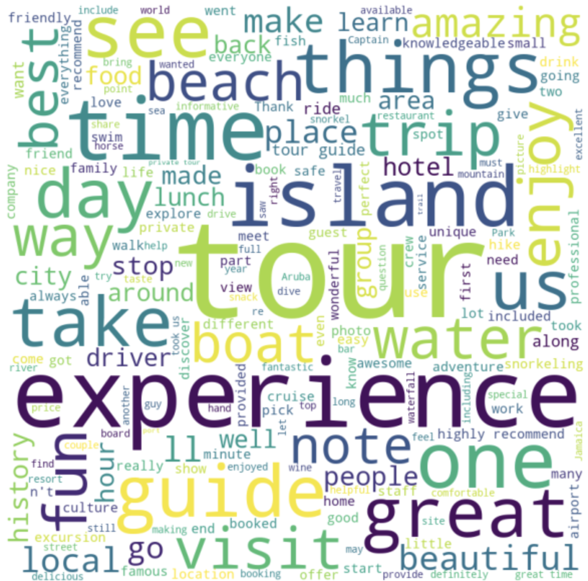

# Travel Review Corpus Annotation - where2go

### Project Team - Sheena Salwan, Shounak Mondal, Quang Vu, Tony Li

## **Introduction**

Today travel search is limited, delivers a poor experience and expects us to know the destination where we want to go. It's not experience-driven but booking-driven. It starts with fixed booking filters instead of free text. It puts the travel companies ( airlines, hotels ) on the front page instead of the travellers. The corpus could be used to build an application which introduces a fresh way to semantically search travel experiences i.e not simply by location and transactional fixed filters but by written descriptions of aspirations, emotions and feelings

Eg: An old couple's travel search could be : ​"A beachside small town where we could dine with the elderly locals watching beautiful sunsets"

**Watch our project video [here](https://www.youtube.com/watch?v=BV_M2In0GxI)**

## Project

An annotated corpus of travel experience/activity descriptions from hosts and reviews from travelers, that could potentially redefine travel experience search. We scraped experiences/attractions/activities for a set of locations ( corpus can be scaled to include more locations) from Airbnb and Tripadvisor. We extracted genres which are activities or experiences, descriptive text and reviews of activities and some meta data information.

{width="639"}

## **Annotations**

Annotations are genre (activity type in this case) and potentially RDF triples capturing the semantic relationships. These RDF triples can be stored in a graph database and queried using SPARQL. Annotated RDF Triples are based on our travel ontology which is built on top of <https://protege.stanford.edu/ontologies/travel.owl>. We mainly focus on Activity and Location Classes from the ontology.

We used Amazon Mechanical Turk to annotate the reviews by 3 annotators to pick all activities from the review text given. We have used avg\_Ao, which is the average observed agreement across all annotators and items and pi as our measures. Based on the agreement study, we observed the agreement score was low around 47% due to the free text field and not a classification problem. We also explored automated annotation using a POS tagger to extract activities.

#### {width="407"}
